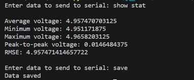
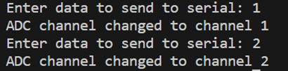

# Arduino_Oscillscope

This is an Arduino-based Oscillscope written in the Atmel Studio 7.0 environment. A PyQt5 based python program is written to read the voltage data and plot them. It can also be used to switch the ADC channels from A0 to A5, show the statistics data and save voltage data.

