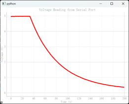
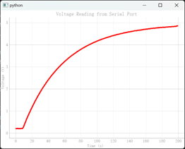
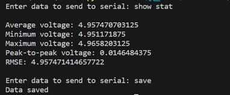
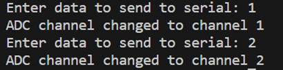

# Arduino_Oscillscope

This is an Arduino-based Oscillscope written in the Atmel Studio 7.0 environment. A PyQt5 based python program is written to read the voltage data and plot them. It can also be used to switch the ADC channels from A0 to A5, show the statistics data and save voltage data.

The performance of this application is not so good as expected, which can only measure the sine wave for 20Hz, that is the sample frequency Fs = 40Hz.

